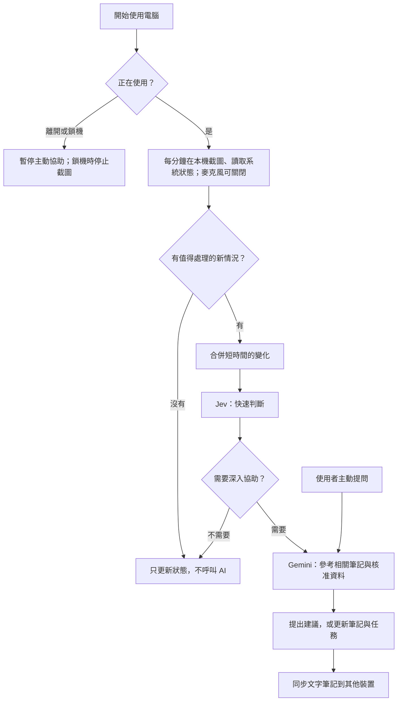

# LinkOS 系統設計（客戶版）

> LinkOS 在工作時留意畫面，適時提供協助，並把有用的內容記成可編輯的筆記。以下是第一版設計，尚未開發。

## 日常流程

## 三個例子

| 情況 | LinkOS 的做法 |
| --- | --- |
| 工作時停在同一畫面 | 繼續在本機比較畫面，不重複呼叫 Gemini；若仍在操作而可能需要協助，最多給一次可略過的提示。 |
| 不停切換網頁 | 把短時間內的切換合併；畫面穩定約 30 秒後才判斷，不逐頁呼叫 AI。第一版不能可靠讀取每頁網址。 |
| 開着電腦出去食飯 | 約 10 分鐘沒有操作便標示「離開」，停止新 AI 呼叫及錄音；鎖機後停止截圖。回來後繼續，不補做錯過的工作。 |

上述時間是**建議起點**，仍待確認。畫面不動不一定代表遇到困難，也可能是在閱讀或思考。

## 資料與界線

- 使用者可隨時暫停觀察或關閉麥克風。有用的內容存成可修改的文字筆記，並同步到其他裝置。原始截圖和錄音只留在本機；截圖保留 2 天，錄音在完成轉錄後保留 2 天。
- 助手只讀取獲准的資料夾，可更新自己的筆記和任務；不能自行執行電腦指令或修改專案程式碼。個人指引檔 `SOUL.md` 只由本人修改。
- 每月 AI 費用目標約 **HK$80**。是否到額後停止付費呼叫，仍待決定。

## 開發前待確認

擷取哪些螢幕與應用程式、離開及提示的時間、語音在本機還是 Gemini 轉錄、費用上限的處理，以及遠端筆記是否需要直接瀏覽。
